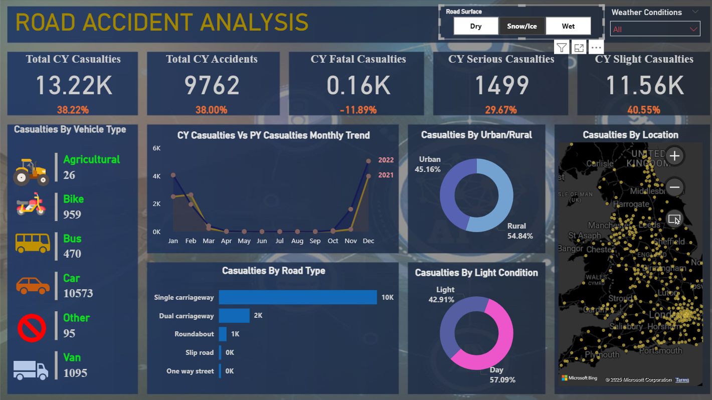

# Road Accident Data Analysis Using Power BI



## 📌 Project Overview
This project provides a comprehensive analysis of road accident data to identify trends, causes, and patterns in accident occurrences. By leveraging **SQL** for data processing and **Power BI** for visualization, we aim to deliver actionable insights that can assist road safety authorities in making data-driven decisions to reduce casualties and improve road safety.

The analysis focuses on comparing **Current Year (CY)** performance against **Previous Year (PY)** benchmarks, tracking key metrics like total casualties, accident severity, and the impact of external factors such as weather and road conditions.

## 📊 Business Metrics & KPIs
The dashboard tracks the following critical Key Performance Indicators (KPIs):

- **Total Casualties (CY)**: The total number of individuals injured or killed in road accidents for the current year.
- **Total Accidents (CY)**: The count of reported accident incidents.
- **Year-on-Year (YoY) Growth**: Percentage increase or decrease in accidents and casualties compared to the previous year.
- **Casualties by Severity**:
  - **Fatal**: Deaths resulting from accidents.
  - **Serious**: Severe injuries requiring hospitalization.
  - **Slight**: Minor injuries.

## 🛠️ Technologies Used


- **Power BI**: For creating interactive dashboards, data visualization, and reporting.
- **SQL (PostgreSQL)**: For data cleaning, transformation, and complex querying of the raw dataset.
- **Microsoft Excel / CSV**: Used as the raw data source.

## 📂 Project Structure
```
Road-Accident-Data-Analysis-Using-PowerBI/
├── img/                # Images and icons used in the dashboard
├── reports/            # PDF exports of the final dashboard (e.g., ROAD ACCIDENT REPORT.pdf)
├── sql/                # SQL scripts for data analysis
│   ├── create_table_load_data.sql  # Schema definition and data loading script
│   └── road_accident_data_analysis.sql # Analytical queries for KPIs and insights
├── Power_BI.png        # Screenshot of the main dashboard
└── README.md           # Project documentation
```

## 🔍 Data Analysis & Logic
The SQL analysis covers several dimensions to provide a holistic view of road safety:

1.  **Vehicle Type Grouping**:
    - Raw vehicle categories are grouped into broader classes: **Car, Bike, Van, Bus, Agricultural, and Other** for clearer visualization.
    - *Logic Source*: `road_accident_data_analysis.sql` logic for `CASE WHEN` statements.

2.  **Trend Analysis**:
    - Monthly trend analysis of casualties to identify high-risk periods during the year.

3.  **Environmental Factors**:
    - **Road Type**: Analysis of accidents on different road types (Single carriageway, Dual carriageway, etc.).
    - **Urban vs. Rural**: comparing accident frequency and severity between urban and rural settings.
    - **Light Conditions**: Impact of daylight vs. dark conditions on accident rates.

## 📜 How to Use
1.  **Data Setup (SQL)**:
    - Run the script `sql/create_table_load_data.sql` to create the `ROAD_ACCIDENT_DATA` table and load the CSV data.
    - *Note: Ensure the file path in the `COPY` command matches your local directory.*

2.  **Run Analysis**:
    - Execute `sql/road_accident_data_analysis.sql` to generate the summary metrics and verify the data logic used in the dashboard.

3.  **View Reports**:
    - Open the `reports/` folder to view pre-generated PDF versions of the dashboard.
    - Alternatively, open the `.pbix` file (if available) in Power BI Desktop to interact with the dashboard.

---
# 👤 Author
Arnab Ghosh
